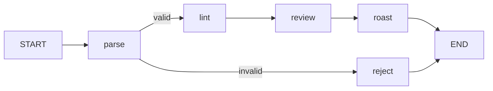

# Roast My YAML 🔥

A LangGraph agent that reviews Kubernetes manifests and roasts every mistake, with a fix for each one. Evaluated with LangSmith (SDK + UI).

Built for the LangChain Technical Support Engineer take-home.

## What it does

| Input | Output |
|---|---|
| A Kubernetes manifest | A short, funny roast with a fix after each joke |
| Anything else (a recipe, broken YAML) | A polite refusal, with no LLM call and no cost |

## How it works (v2)



| Step | Type | Job |
|---|---|---|
| `parse` | Python | Is this a Kubernetes manifest? (YAML with `apiVersion` + `kind`) |
| `lint` | Python rules | Catches what's *missing*: resources, probes, bare Pods |
| `review` | LLM, structured output | Finds everything else as `{issue, severity, fix}` |
| `roast` | LLM | Turns the findings into jokes + fixes |
| `reject` | Python | Polite refusal for anything that isn't a manifest |

State: `manifest`, `error`, `findings`, `output`. Steps never call each other; they only read and write the shared state.

## Evaluation

Dataset: `dataset/` has 10 hand-labeled cases: 7 manifests with 1–3 planted bugs, 1 clean manifest, and 2 invalid inputs. The answer key is `dataset/answer_key.json`.

| Evaluator | Runs in | Measures |
|---|---|---|
| `catch_rate` | SDK (code) | Share of planted bugs mentioned in the findings |
| `false_alarms` | SDK (code) | Warning/critical findings on the clean manifest (lower is better) |
| `correct_route` | SDK (code) | Rejects exactly the inputs that aren't manifests |
| `roast_tone` | LangSmith UI (LLM-as-judge, bound to the dataset) | Funny, kind to the person, every joke has a fix |

### Results (3 repetitions per example)

| Metric | v1 (LLM only) | v2 (+ lint rules) |
|---|---|---|
| catch_rate | 0.85 | **1.00** |
| correct_route | 1.00 | 1.00 |
| false_alarms (lower is better) | 2.33 | 1.33* |
| roast_tone | n/a (judge added later) | 1.00 |
| P50 latency | 3.11 s | 3.72 s |

*v2 changed nothing that affects false alarms, so I read this drop as run-to-run variance, not an improvement.

**What the data showed:** v1 caught every bug that's *written* in the YAML (privileged, hostNetwork, plaintext secrets) but missed bugs that are about something *missing* (no probes, no resources, bare Pods), and it missed them inconsistently between runs. v2 adds deterministic rules for exactly those, so they're caught every time.

## Run it

Tested on WSL2 (Ubuntu 24.04) with Python 3.12.

```bash
git clone https://github.com/HeyNaNd0/langgraph-agent-evals.git
cd langgraph-agent-evals
python3 -m venv .venv && source .venv/bin/activate
pip install -r requirements.txt
```

On Ubuntu, `python3 -m venv` needs `sudo apt install python3-venv` first.

Create a `.env` file:

```
LANGSMITH_TRACING=true
LANGSMITH_PROJECT=langgraph-agent-evals
LANGSMITH_API_KEY=...
OPENAI_API_KEY=...
```

| Command | What it does |
|---|---|
| `python smoke_test.py` | Checks your LangSmith connection (no LLM) |
| `python llm_smoke_test.py` | Checks your OpenAI key |
| `python agent.py` | Roasts 3 sample inputs |
| `python create_dataset.py` | Uploads the test cases to LangSmith |
| `python run_eval.py` | Runs the experiment and prints what went wrong |
| `langgraph dev` | Opens the agent in LangGraph Studio (first run `pip install "langgraph-cli[inmem]"`) |

## What's next

- **v3:** a severity rubric in the review prompt to cut false alarms on clean manifests. One change at a time, measured.
- **Judge calibration:** `roast_tone` passed every run. I'd test it against deliberately bad roasts to confirm it can fail.
- **Roast repetition:** the roast prompt's "3 to 6 lines" forces padding when there's only one finding.
- **Dataset v2:** split `/livez` and `/readyz` in the clean manifest so it's unambiguously clean.

## Notes and feedback

- [`NOTES.md`](NOTES.md): what I learned and what surprised me
- [`FRICTION_LOG.md`](FRICTION_LOG.md): product feedback from a first-time user

## How I built this

This was my first time using LangGraph and LangSmith. I used Claude as a pair programmer and tutor: it explained concepts and drafted code step by step. I ran, tested, and debugged every step, and the decisions are mine: the agent idea, the test cases and answer key, how to grade them, and what the results meant.
